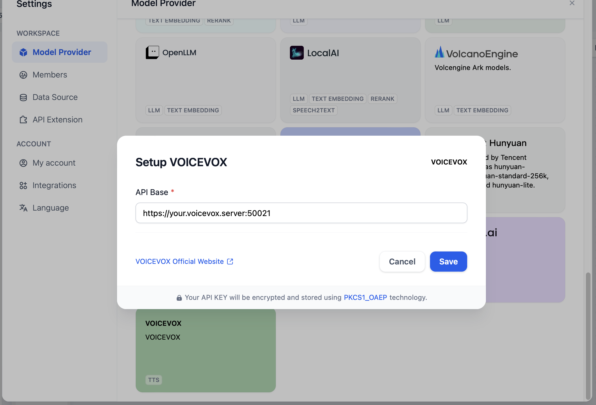
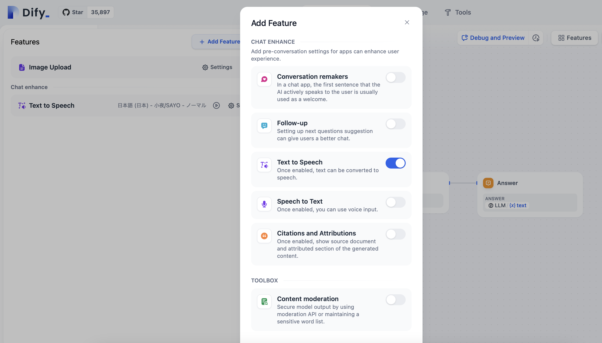

# dify-voicevox-tts

An experimental implementation of VOICEVOX text-to-speech custom model for Dify.

## 📦 Installation

If you want to install VOICEVOX plugin, the fastest way is to install it via [Dify Marketplace](https://marketplace.dify.ai/).

You can also manually download [voicevox-tts.difypkg](https://github.com/uezo/dify-voicevox-tts/blob/main/voicevox-tts.difypkg) and upload it to your Dify.
If you don't know how to do so, please refer https://docs.dify.ai/en/plugins/quick-start/install-plugins#local-file-upload.

## ✨ Add model

Set up VOICEVOX in the list of model providers. The URL must be reachable from the inside of the API container. `http://127.0.0.1:50021` doesn't work without any network configurations.

## 🥳 Use TTS feature

Click [Features] > [+ Add Feature] and turn on `Text to Speech`.

Enjoy👍

## Required APIs, credentials and connection requirements

VOICEVOX plugin only requires [voicevox_engine](https://github.com/VOICEVOX/voicevox_engine) to
generate audio.
As long as VOICEVOX plugin can access to voicevox_engine server, it will work well.

## 🙏 I NEED YOUR CONTRIBUTION

This is just an experimental implementation, and we need your help to make it better. Please contribute! 🚀✨
